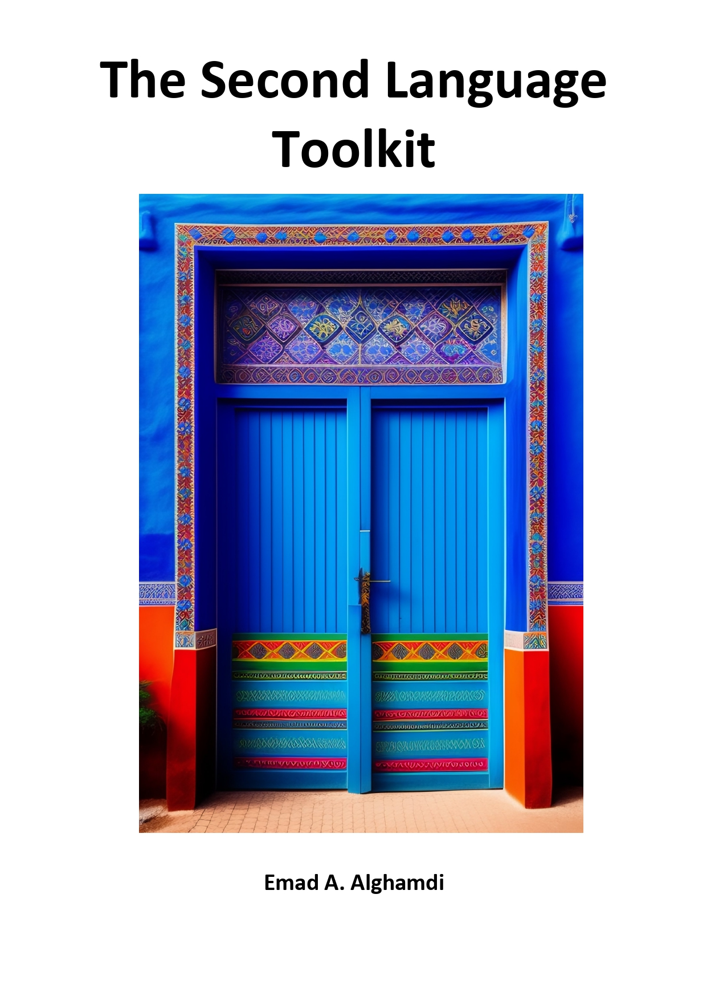

<!--  -->

<!--  -->

# **Data collection in Second Language Research: A Catalogue of Scales, Instruments, Tools, and Tasks **

<!-- “The idea is to make a collection of instruments, tools, and tasks used in L2 research. Using the book, SLA researchers can browse different instruments, and know when and how to use them. For each instrument or scale, the book will show a popularity index [score or icon showing how popular the tool is. It is the number of the citations each instrument receives divided by the sum of the citations of all instruments in the same category]”

The objectives of using tools and instruments in research for data collection are:

To ensure the accuracy and reliability of data: By using standardized tools and instruments, researchers can ensure that data is collected in a consistent and reliable manner, reducing the likelihood of errors or bias in the data.

To increase the validity of research findings: Validity refers to the extent to which a study measures what it intends to measure. The use of appropriate tools and instruments can increase the validity of research findings by ensuring that the data collected is relevant to the research questions or hypotheses.

To enhance the efficiency of data collection: Tools and instruments can help to streamline the data collection process, making it more efficient and reducing the amount of time and resources required to collect and analyze data.

To facilitate comparisons across studies: Standardized tools and instruments allow for comparisons to be made across different studies, making it easier to identify patterns and trends in the data.

To increase the generalizability of research findings: By using standardized tools and instruments, researchers can increase the generalizability of their findings, making it more likely that their results will be applicable to other populations or contexts.

Overall, the use of tools and instruments in research for data collection is essential for ensuring the accuracy, reliability, and validity of research findings, and for facilitating comparisons across studies and increasing the generalizability of research results. -->

## **Inclusion criteria**

<!-- 1. the test/tool should focus on L2
2. it should be cited and used in several studies (20 citations)
3. focus on the macro skills (vocabulary, reading, grammar, listening, and speaking, pronunciation) and micro-skills ()
4. used in studies published in the last two decades
5. L2 learners can be children or adult
6. It should be freely accessible
7. Any L2 but mostly English
8. should be published in one of the following journals
   a. language learning
   b. studies in second language acquisition
   c. applied linguistics
   d. the modern language
   e. TESOL Quarterly -->

## **How to navigate the book**

## **Contributors**

This living book would not be possible without the invaluable contributions from the following members of my AILLA lab: **Alaa Saleh, Mahmoud Aljadani, Dalal, Norah, and Ghadi**. I am truly grateful for the time and effort you have invested in this project. Your dedication, hard work, and expertise have been instrumental in making this project a success.
